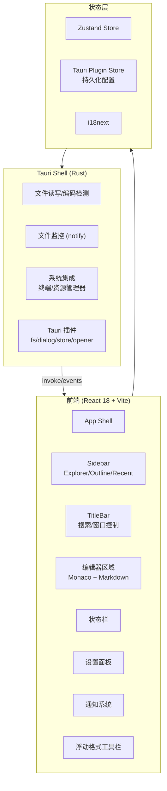
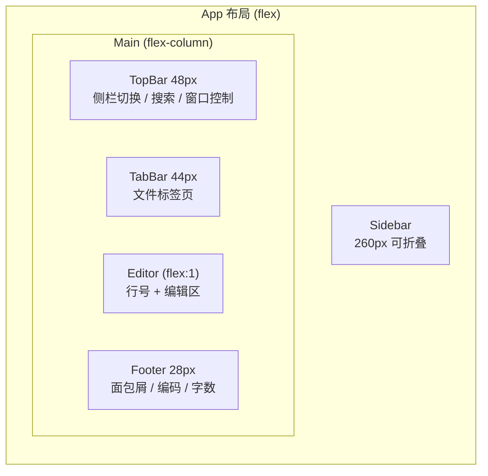

# MDE-Tauri 跨平台 Markdown 编辑器 -- 项目计划书

## 一、项目概述

构建一个基于 **Tauri 2.0 (Rust + Webview)** 的跨平台 Markdown 编辑器，支持 Windows / Linux / Android 三端运行。

**三个关键输入来源：**
- **[miaogu-notepad](miaogu-notepad/)** -- Tauri 2.0 构建参考（已验证三端可运行，复用其 Tauri 配置、插件体系、Rust 后端命令模式）
- **[markdown-editor](markdown-editor/)** -- 旧 Electron 项目的前端架构参考（复用其组件体系、CSS 设计系统、i18n 模式、主题切换机制）
- **[UI/md-editor.html](UI/md-editor.html)** -- 最终 UI 设计目标（复用其完整布局、色彩系统、交互模式）

## 二、技术栈确认

| 层级 | 技术选型 | 来源依据 |
|------|---------|---------|
| 系统框架 | Tauri 2.0 | miaogu-notepad 已验证 |
| 前端框架 | Vite + React 18 (JSX) | 需求文档要求 JavaScript |
| UI 库 | Ant Design 5 | 需求文档指定 |
| 状态管理 | Zustand | 需求文档指定，比 Redux 更轻量 |
| 编辑器核心 | Monaco Editor | miaogu-notepad 已集成 |
| Markdown 渲染 | react-markdown + remark/rehype 插件链 | miaogu-notepad 已验证 |
| i18n | i18next + react-i18next | 需求文档指定 |
| 图表库 | AntV G2 | 需求文档指定（后续增量） |
| CSS 方案 | SCSS + CSS 变量设计系统 | markdown-editor 的 token 体系 |
| Rust 后端 | 文件 I/O、编码检测、文件监控 | miaogu-notepad 的 lib.rs |

## 三、架构设计

### 3.1 整体架构



### 3.2 前端布局结构（对应 UI 设计稿）



这一布局沿用 markdown-editor 的 **Grid 布局思想**（`grid-template-columns: sidebar auto; grid-template-rows: title-bar auto footer`），但根据 UI 设计稿将 TopBar 和 TabBar 从 title-bar 中分离为独立行。

### 3.3 Rust 后端命令（直接复用 miaogu-notepad）

从 [miaogu-notepad/src-tauri/src/lib.rs](miaogu-notepad/src-tauri/src/lib.rs) 直接继承的核心命令：

- `read_file_content` -- 读取文件（自动编码检测）
- `write_file_content` / `save_file` -- 写入/保存文件
- `get_directory_contents` -- 读取目录
- `rename_file` / `check_file_exists` / `get_file_info` -- 文件操作
- `start_file_watching` / `stop_file_watching` -- 文件变更监控
- `execute_file` / `open_in_terminal` / `show_in_explorer` -- 系统集成
- `show_main_window` -- 窗口显示控制

**需要裁剪的命令**（与本项目无关）：
- 自动更新相关（`check_for_updates`, `download_update` 等）
- CLI 安装相关（`install_cli`, `uninstall_cli`）
- 代理/图片加载（`load_image_with_proxy`）

### 3.4 前端组件复用（从 markdown-editor 迁移）

从 [markdown-editor/src/renderer/](markdown-editor/src/renderer/) 迁移的架构模式：

**布局组件**（需从 Electron IPC 适配为 Tauri invoke）：
- `MdeSidebar` -- 侧栏（主题切换动画、标签页视图切换）
- `MdeTitleBar` -- 标题栏（窗口控制改用 Tauri API）
- `MdeContent` -- 内容区（当前为空壳，需实装编辑器）
- `MdeFooter` -- 状态栏（当前为空壳，需实装）

**UI 原子组件**：
- `MdeButton`, `MdeToggleButton`, `MdeIcon`, `MdeText`, `MdeTooltip`, `MdeDivider`, `MdeTab`, `MdeFlexBlank`

**设计系统**：
- 从 [markdown-editor/src/renderer/assets/styles/index.scss](markdown-editor/src/renderer/assets/styles/index.scss) 迁移 CSS 变量体系
- `--theme-bg-app`, `--theme-bg-component`, `--theme-color-primary` 等 token
- 明暗主题通过 `html[data-theme="dark"]` 切换
- 字体：Poppins (UI) + JetBrains Mono (编辑器) + Source Han Sans (中文)
- View Transition API 的圆形主题切换动画

**i18n 模式**：
- 从 markdown-editor 的自定义 I18n 类改为 `i18next` + `react-i18next`（符合需求文档指定）
- 保留 `zh_cn.json` / `en_us.json` 语言文件结构

**配置系统**：
- 从 Electron 的 `electron-store` 迁移到 Tauri 的 `@tauri-apps/plugin-store`
- 保留 `ConfigProxy` 的 get/set 抽象接口模式

## 四、分阶段开发计划

### 第一阶段：项目脚手架搭建（基础可运行）

**目标：** 创建一个能在 Windows 上正常运行的 Tauri 2.0 + React 18 空壳应用

**具体任务：**
1. 在 `mde-tauri/` 根目录下创建新项目 `mde`（或直接作为主项目目录）
2. **Tauri 配置** -- 直接参照 [miaogu-notepad/src-tauri/tauri.conf.json](miaogu-notepad/src-tauri/tauri.conf.json)：
   - `Cargo.toml` 复用依赖（tauri 2.0, plugin-fs, plugin-dialog, plugin-store, plugin-opener, encoding_rs, notify, serde 等）
   - `tauri.conf.json` 配置窗口（frameless, 1200x800, decorations:false）
   - `capabilities/default.json` 权限声明
3. **前端脚手架** -- Vite + React 18 + SCSS：
   - `package.json` 基础依赖（react 18, antd 5, zustand, i18next, monaco-editor, react-markdown 等）
   - `vite.config.js` 配置路径别名（`@`, `@renderer`, `@assets`, `@ui`, `@layout`, `@styles`）
4. **Rust 后端** -- 从 miaogu-notepad 精简 `lib.rs`：
   - 保留文件 I/O、目录读取、编码检测、文件监控核心命令
   - 去除更新检查、CLI 安装、代理等无关命令
5. **验证：** `npm run tauri:dev` 能正常启动带空白页面的 Tauri 窗口

### 第二阶段：前端基础架构迁移

**目标：** 从 markdown-editor 迁移组件架构和设计系统，建立完整的 UI 外壳

**具体任务：**
1. **设计系统移植**：
   - 移植 `index.scss` 的 CSS 变量体系（light/dark token）
   - 整合 UI 设计稿 (`md-editor.html`) 中的色彩变量（`--bg`, `--surface`, `--accent` 等）
   - 移植字体文件（Poppins, JetBrains Mono, Source Han Sans）
2. **UI 原子组件迁移**（从 markdown-editor 的 `@ui/*`）：
   - Button, ToggleButton, Icon, Text, Tooltip, Divider, Tab, FlexBlank
   - **适配**：将 IPC 相关调用替换为 Tauri API（`@tauri-apps/api`）
3. **布局组件搭建**（参照 UI 设计稿的最终形态）：
   - **Sidebar** -- Logo + 三标签页（Explorer/Outline/Recent）+ 滑动指示器 + 工具栏 + 文件树 + 页脚
   - **TopBar** -- 侧栏切换按钮 + 搜索触发器 + 窗口控制（min/max/close 使用 Tauri window API）
   - **TabBar** -- 文件标签页（带关闭、滚动、书签、分屏按钮）
   - **Editor** -- 行号 + 内容区（暂用占位）
   - **Footer** -- 侧栏切换 + 面包屑 + 编码信息 + 字数统计
4. **主题切换** -- 移植 markdown-editor 的 View Transition 圆形动画
5. **i18n 初始化** -- i18next 配置 + zh_cn/en_us 语言文件
6. **Zustand Store 建立**：
   - `useThemeStore` -- 主题状态
   - `useEditorStore` -- 编辑器状态（打开的文件、活跃标签页）
   - `useConfigStore` -- 配置状态（与 Tauri plugin-store 同步）

### 第三阶段：文件管理系统实现

**目标：** 完成侧栏文件资源管理器的完整功能

**具体任务：**
1. **文件树组件** -- 对接 Rust 的 `get_directory_contents` 命令：
   - 文件夹展开/折叠
   - 文件图标（按扩展名区分颜色，参照 UI 设计稿）
   - 文件删除（hover 显示删除按钮）
   - 面包屑导航（`D:` > `...` > `Notes`）
   - 导航工具栏（后退/前进/上级/刷新/在资源管理器打开）
   - 排序功能（升序/降序，按名称/时间/大小）
2. **文件打开/保存** -- 对接 Tauri dialog + Rust 文件命令：
   - `plugin-dialog` 的 open/save 对话框
   - `read_file_content` 读取 + 编码自动检测
   - `save_file` 保存 + 编码保持
   - `start_file_watching` / `file-changed` 事件监听外部修改
3. **标签页管理**：
   - 多文件标签页的打开/关闭/切换
   - 标签页滚动
   - 未保存标记（修改点指示器）
4. **最近文件列表** -- Recent 标签页的实现
5. **全文搜索模态框** -- 对接搜索UI（`Ctrl+P` 快捷键打开，文件名模糊匹配）

### 第四阶段：Markdown 编辑器核心（重点阶段）

**目标：** 实现完全参考 Typora 模式的 Markdown 编辑与渲染

**具体任务：**
1. **Monaco Editor 集成**：
   - 代码编辑模式（源码视图）
   - 语法高亮（Shiki/Prism 主题）
   - 行号显示
2. **Markdown 实时预览**（react-markdown + remark/rehype 插件链）：
   - GFM 扩展语法（表格、任务列表、删除线）-- `remark-gfm`
   - 数学公式 -- `remark-math` + `rehype-katex`
   - 代码高亮 -- `rehype-highlight` 或 Prism
   - 原始 HTML 支持 -- `rehype-raw` + `rehype-sanitize`（安全过滤）
3. **Typora 风格所见即所得模式**：
   - 编辑区的实时渲染切换
   - 光标所在行显示源码，其他行显示渲染结果
4. **浮动格式工具栏**（参照 UI 设计稿的 Toolbar）：
   - 加粗/斜体/删除线
   - 标题选择（H1-H6 弹出面板）
   - 引用、表格、代码块插入
   - 工具栏可拖拽、可折叠
5. **大纲视图**（Outline 标签页）：
   - 从 Markdown 内容自动提取标题层级
   - 点击标题跳转到对应位置
   - 折叠/展开控制
6. **增强型组件**：
   - 代码块内代码片段直接执行（JS 使用 eval / Python 通过 Rust 的 Command）
   - 自定义树状图组件渲染

### 第五阶段：设置系统 / 通知系统 / 搜索

**目标：** 完善辅助功能模块

**具体任务：**
1. **设置面板**（参照 UI 设计稿 720x520 模态框）：
   - 分类导航（General / Appearance / Editor）
   - 控件类型：select、input、switch、slider、number、button
   - 基于 JSON 的配置系统（通过 Tauri plugin-store 持久化）
   - 快捷键自定义
   - 配置导入/导出
2. **通知系统**（参照 UI 设计稿的 Toast）：
   - 四种类型：success / error / warning / info
   - 自动消失 + 进度条动画
   - 右上角堆叠显示
3. **全文搜索引擎**：
   - 前端搜索 UI 模态框（带 blur 背景）
   - 未来集成 Tantivy (Rust 全文搜索库) 支持模糊匹配
4. **快捷键系统**：
   - `Ctrl+P` -- 搜索
   - `Ctrl+,` -- 设置
   - `Ctrl+B` -- 切换侧栏
   - `Ctrl+S` -- 保存
   - `Escape` -- 关闭弹窗

### 第六阶段：主题完善 / i18n / 数据可视化

**目标：** 完善个性化和扩展功能

**具体任务：**
1. **完整暗色主题** -- 基于 markdown-editor 的 dark token + UI 设计稿扩展
2. **i18n 完善** -- 所有 UI 文本的中英文翻译
3. **AntV 数据可视化** -- 笔记统计图表（字数趋势、文件类型分布等）

### 第七阶段：测试 / 优化 / 多端验证

**目标：** 确保三端稳定可用

**具体任务：**
1. Windows 端完整功能测试
2. Linux 端编译测试（参照 miaogu-notepad 的 deb 配置）
3. Android 端初始化（`tauri android init`）和基本功能验证
4. 性能优化（Vite 手动分包、懒加载）
5. 文件关联注册（.md, .txt 等）

## 五、文件结构规划

```
mde/
  src-tauri/
    Cargo.toml                    # 从 miaogu-notepad 精简
    tauri.conf.json               # 窗口/插件/权限配置
    capabilities/default.json     # 权限声明
    src/
      main.rs                     # 入口 + CLI 参数处理
      lib.rs                      # 核心命令（文件I/O/监控/系统集成）
  src/
    main.jsx                      # React 入口
    App.jsx                       # 根组件
    store/                        # Zustand stores
      useThemeStore.js
      useEditorStore.js
      useConfigStore.js
      useFileStore.js
    components/
      layout/                     # 布局组件
        sidebar/                  # 侧栏 (Explorer/Outline/Recent)
        title-bar/                # 顶部栏 (搜索+窗口控制)
        tab-bar/                  # 文件标签页
        content/                  # 编辑器区域
        footer/                   # 状态栏
      ui/                         # 原子组件 (从 markdown-editor 迁移)
        button/
        icon/
        text/
        tooltip/
        tab/
        divider/
      editor/                     # 编辑器相关
        MonacoEditor.jsx
        MarkdownPreview.jsx
        FloatingToolbar.jsx
      overlays/                   # 弹层
        SearchModal.jsx
        SettingsModal.jsx
      notification/               # 通知系统
        NotificationContainer.jsx
    hooks/                        # 自定义 hooks
      useFileManager.js
      useI18n.js
      useTauriStore.js
    utils/                        # 工具函数
      tauriApi.js                 # Tauri API 封装
      fileUtils.js
    i18n/                         # 国际化
      index.js
      locales/
        zh_cn.json
        en_us.json
    assets/
      styles/
        index.scss                # 全局 CSS 变量 + reset
        App.scss                  # 布局 grid
      font/                       # 字体文件
      icons/                      # SVG 图标
  index.html
  package.json
  vite.config.js
```

## 六、关键风险与规避策略

- **Electron 到 Tauri 的 IPC 迁移** -- markdown-editor 使用了装饰器模式 (`@IpcHandle`) 注册 IPC；Tauri 使用 `#[tauri::command]` + `invoke`。需将前端所有 `IpcHelper.request` / `IpcHelper.emit` 替换为 `@tauri-apps/api` 的 `invoke` / `listen`。
- **窗口控制差异** -- Electron 的 `ipcRenderer.send('window:minimize')` 需改为 Tauri 的 `appWindow.minimize()`（来自 `@tauri-apps/api/window`）。
- **文件系统 API 差异** -- Electron 的 Node.js `fs` 需改为 Tauri plugin-fs 或 Rust 命令。miaogu-notepad 已经封装好了 `tauriApi.js`，可直接参考其模式。
- **Android 端限制** -- 部分桌面命令（终端、资源管理器）在移动端不可用，需在前端做平台判断和 UI 隐藏。
- **Monaco Editor 在 Webview 中的兼容性** -- miaogu-notepad 已验证可行，采用相同的 worker 配置。
